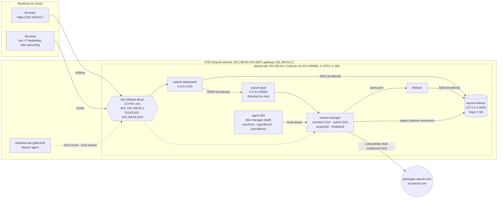

# Network diagram

The real values from the installed lab (2026-09-30): Wazuh 4.14.8 all-in-one on ubuntu-lab,
behind UTM's Shared (NAT) network.

## Ports

| Port | Listener | Bound to | Reachable from | Why |
|------|----------|----------|----------------|-----|
| 22/tcp | sshd | 0.0.0.0 | anywhere, rate-limited (`ufw limit`) | admin access; hardening-lab |
| 443/tcp | wazuh-dashboard | 0.0.0.0 | 192.168.64.1 (the Mac) only | web UI |
| 1514/tcp | wazuh-remoted | 0.0.0.0 | 192.168.64.0/24 | agent events (AES-encrypted) |
| 1515/tcp | wazuh-authd | 0.0.0.0 | 192.168.64.0/24 | agent enrollment |
| 55000/tcp | wazuh-apid | 0.0.0.0 | **VM only** (ufw blocks it) | the dashboard uses it over localhost |
| 9200/tcp | wazuh-indexer | 127.0.0.1 | **VM only** (not bound externally) | OpenSearch; filebeat, dashboard, indexer-connector |
| 1516/tcp | cluster | not listening | nobody | single node; no cluster |

From the Mac, 443 returns the login page. 9200 and 55000 both refuse connections (checked with
`nc -z` on 2026-09-30).
